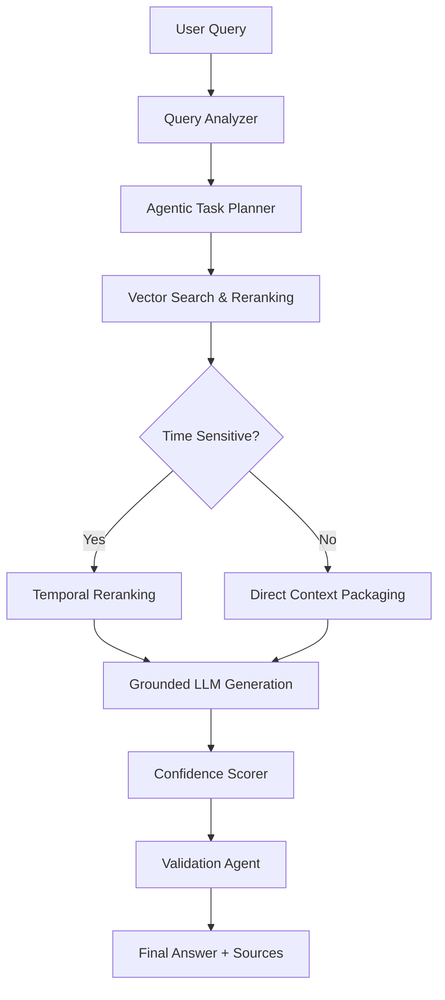

# RAGI: Next-Gen STCA-RAG Pipeline 🚀

[](https://fastapi.tiangolo.com/)
[](https://reactjs.org/)
[](https://www.mongodb.com/atlas/database)
[](https://github.com/langchain-ai/langgraph)

**RAGI** is a sophisticated, agentic Retrieval-Augmented Generation (RAG) system built on the **STCA** framework: **S**emantic, **T**emporal, **C**onfidence, and **A**gentic. Unlike traditional RAG pipelines, RAGI leverages advanced orchestration via LangGraph to provide enterprise-grade accuracy, source attribution, and multimodal document understanding.

---

## 🏛️ The STCA Architecture

RAGI is built on four core pillars that ensure hallucination-free and context-aware responses:

1.  **S - Semantic (Deep Retrieval):** Uses vector embeddings and LLM-based list-wise reranking to ensure only the most relevant context reaches the generator.
2.  **T - Temporal (Time-Aware):** Automatically detects time-sensitive queries and prioritizes recent data through temporal decay and chronological sorting.
3.  **C - Confidence (Auto-Scoring):** Every answer is accompanied by a confidence percentage calculated from semantic similarity, evidence coverage, and validation agent feedback.
4.  **A - Agentic (Dynamic Planning):** Uses an **Agentic Task Planner** to break down complex queries into executable steps and a **Validation Agent** to verify groundedness.

### 🔄 Multi-Stage Pipeline Flow



---

## ✨ Key Features

-   **📁 Multimodal Support:** Extracts data from PDFs (with images/tables), Office docs, CSVs, JSON, MD, and even Audio/Images using Llama 4 Scout & PyMuPDF.
-   **⛓️ Agentic Orchestration:** Powered by **LangGraph**, the system handles complex reasoning loops and self-correction.
-   **💎 SaaS-Ready:** Includes guest access with query limits, user authentication (JWT), and a manual payment verification system for premium upgrades.
-   **🔑 API Access:** Generate project-specific API keys to integrate RAGI's intelligence into external applications.
-   **🧹 Auto-Cleanup:** Integrated background tasks for automatic purging of expired guest documents from MongoDB Atlas.

---

## 🛠️ Tech Stack

### Backend
-   **Framework:** FastAPI (Python 3.10+)
-   **Orchestration:** LangGraph & LangChain
-   **Database:** MongoDB Atlas (GridFS for files, Vector Search for embeddings)
-   **Inference:** Groq (Llama 3.3/3.1) for lightning-fast reasoning
-   **Embeddings:** FastEmbed (Local execution, no API cost)
-   **Processing:** MarkItDown, PyMuPDF, Pillow

### Frontend
-   **Framework:** React 19 (Vite)
-   **Styling:** Modern Vanilla CSS + Framer Motion (Animations)
-   **Icons:** Lucide React
-   **Rendering:** React Markdown with GFM support

---

## 🚀 Installation & Setup

### Prerequisites
-   Python 3.10+
-   Node.js 18+
-   MongoDB Atlas account
-   Groq API Key

### 1. Backend Setup
```bash
cd backend
python -m venv venv
source venv/bin/activate  # Windows: venv\Scripts\activate
pip install -r requirements.txt
```
Create a `.env` file in `/backend`:
```env
MONGODB_URI=your_mongodb_atlas_uri
GROQ_API_KEY=your_groq_api_key
SECRET_KEY=your_jwt_secret
```
Run the server:
```bash
python main.py
```

### 2. Frontend Setup
```bash
cd frontend
npm install
```
Create a `.env` file in `/frontend`:
```env
VITE_API_URL=http://localhost:8000
```
Run the development server:
```bash
npm run dev
```

---

## 🖼️ Architecture & Logic

### 🔄 STCA Pipeline


### 📈 STCA Confidence Formula


---
Developed with ❤️ by Senior Software Engineer.
